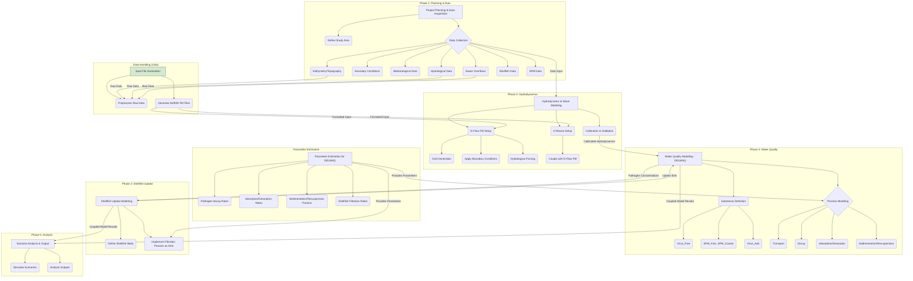

```mermaid
graph TD
    subgraph "Phase 1: Planning & Data"
        A[Project Planning & Data Acquisition]
        A --> B(Define Study Area)
        A --> C{Data Collection}
        C --> C1(Bathymetry/Topography)
        C --> C2(Boundary Conditions)
        C --> C3(Meteorological Data)
        C --> C4(Hydrological Data)
        C --> C5(Sewer Overflows)
        C --> C6(Shellfish Data)
        C --> C7(SPM Data)
    end

    subgraph "Phase 2: Hydrodynamics"
        D[Hydrodynamic & Wave Modeling]
        D --> E(D-Flow FM Setup)
        E --> E1(Grid Generation)
        E --> E2(Apply Boundary Conditions)
        E --> E3(Hydrological Forcing)
        D --> F(D-Waves Setup)
        F --> F1(Couple with D-Flow FM)
        D --> G(Calibration & Validation)
    end

    subgraph "Phase 3: Water Quality"
        H[Water Quality Modeling - DELWAQ]
        H --> I(Substance Definition)
        I --> I1(Virus_Free)
        I --> I2(SPM_Fine, SPM_Coarse)
        I --> I3(Virus_Ads)
        H --> J{Process Modeling}
        J --> J1(Transport)
        J --> J2(Decay)
        J --> J3(Adsorption/Desorption)
        J --> J4(Sedimentation/Resuspension)
    end
    
    subgraph "Parameter Estimation"
        P[Parameter Estimation for DELWAQ]
        P --> P1(Pathogen Decay Rates)
        P --> P2(Adsorption/Desorption Rates)
        P --> P3(Sedimentation/Resuspension Params)
        P --> P4(Shellfish Filtration Rates)
    end

    subgraph "Phase 4: Shellfish Uptake"
        K[Shellfish Uptake Modeling]
        K --> L(Define Shellfish Beds)
        K --> M(Implement Filtration Process as Sink)
    end

    subgraph "Phase 5: Analysis"
        N[Scenario Analysis & Output]
        N --> O(Simulate Scenarios)
        N --> Q(Analyze Outputs)
    end

    subgraph "Data Handling (Julia)"
        Z[Input File Generation]
        Z --> Z1(Preprocess Raw Data)
        Z --> Z2(Generate Delft3D FM Files)
        style Z fill:#D5E8D4,stroke:#82B366,stroke-width:2px
    end

    C -- Data Input --> D
    G -- Calibrated Hydrodynamics --> H
    P -- Provides Parameters --> J
    P -- Provides Parameters --> M
    H -- Pathogen Concentrations --> K
    K -- Uptake Sink --> H
    H & K -- Coupled Model Results --> N
    C1 & C4 & C5 -- Raw Data --> Z1
    Z2 -- Formatted Input --> E & F
```
