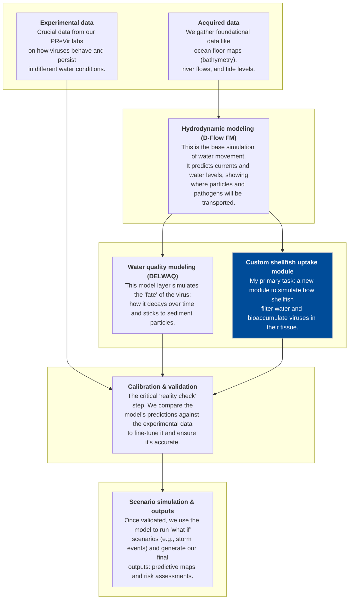

```mermaid

graph TD
    subgraph " "
        A["<b>Acquired data</b><br>We gather foundational data like<br>ocean floor maps (bathymetry),<br>river flows, and tide levels."]
        B["<b>Experimental data</b><br>Crucial data from our PReVir labs<br>on how viruses behave and persist<br>in different water conditions."]
    end

    subgraph " "
        C["<b>Hydrodynamic modeling (D-Flow FM)</b><br>This is the base simulation of water movement.<br>It predicts currents and water levels, showing<br>where particles and pathogens will be transported."]
    end

    subgraph " "
        D["<b>Water quality modeling (DELWAQ)</b><br>This model layer simulates the 'fate' of the virus:<br>how it decays over time and sticks to sediment particles."]
        E["<b>Custom shellfish uptake module</b><br>My primary task: a new module to simulate how shellfish<br>filter water and bioaccumulate viruses in their tissue."]
    end

    subgraph " "
        F["<b>Calibration & validation</b><br>The critical 'reality check' step. We compare the<br>model's predictions against the experimental data<br>to fine-tune it and ensure it's accurate."]
    end

    subgraph " "
        G["<b>Scenario simulation & outputs</b><br>Once validated, we use the model to run 'what if'<br>scenarios (e.g., storm events) and generate our final<br>outputs: predictive maps and risk assessments."]
    end


    A --> C
    B --> F
    C --> D
    C --> E
    D --> F
    E --> F
    F --> G

    style E fill:#004c99,stroke:#ccc,stroke-width:2px,color:#fff

```
