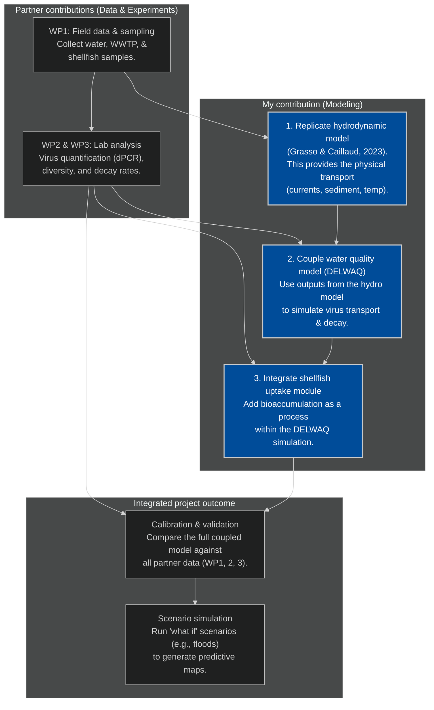

## previr plans wur

| phase                                     | key tasks                                                                                                      |
|-------------------------------------------|----------------------------------------------------------------------------------------------------------------|
| phase 1: establish the base model (Loire) | download and run the existing Loire estuary model from the Grasso & Caillaud paper.                            |
|                                           | confirm the model reproduces the validated simulation of the estuary's physics (water, sediment, temperature). |
| phase 2: add the water quality component  | couple DELWAQ to read the output files from the hydrodynamic model.                                            |
|                                           | define viruses as a substance in DELWAQ and implement decay/transport processes using WP3 lab data.            |
| phase 3: build the shellfish module       | develop the custom module for shellfish bioaccumulation as a process within DELWAQ.                            |
|                                           | validate and calibrate the module using the oyster data from WP2.                                              |
| phase 4: test the fully integrated system | run the complete, coupled model (hydrodynamics -> DELWAQ -> shellfish).                                        |
|                                           | compare model predictions against the full dataset from WP1, WP2, and WP3.                                     |
| phase 5: run predictive scenarios         | use the validated model to simulate key events, like floods or droughts.                                       |
|                                           | generate final outputs: predictive maps and risk assessments for the Loire.                                    |
| phase 6: apply methodology to Irish site  | begin model setup for the Irish estuary (new grid, bathymetry, boundary conditions).                           |

## previr plans wur as a flowchart

