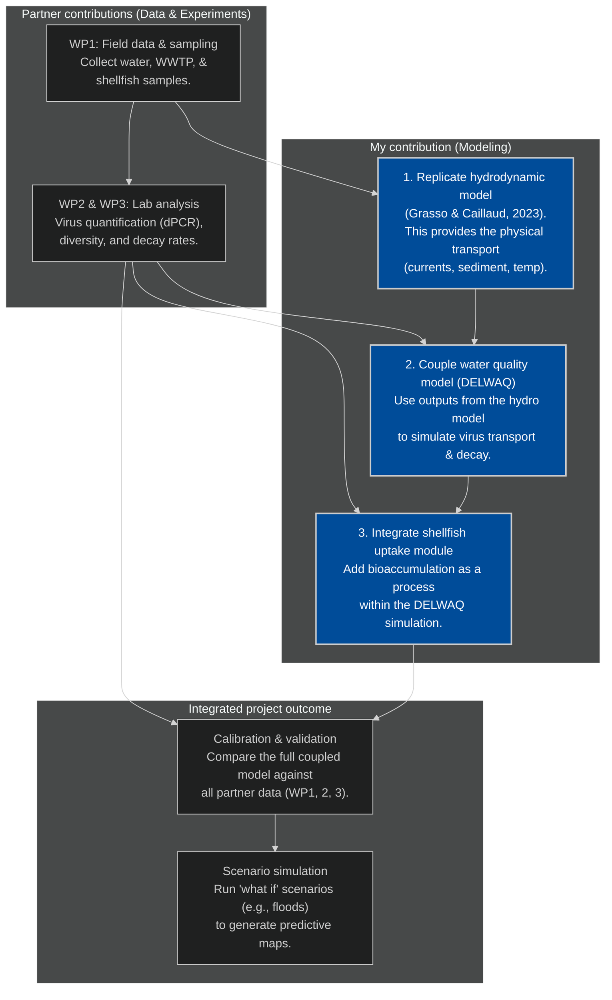

# PReVir project: Mechanistic modeling.

This repository serves as the central hub for the modeling work package of our project. The goal here is to develop a predictive, mechanistic model for enteric virus concentrations in coastal shellfish. We'll be using the Delft3D FM Suite (or the Grasso paper) to couple a hydrodynamic model with custom-built modules for virus fate and shellfish bioaccumulation, all driven by the experimental data our partners (you!) are generating.

On this page, I will be presenting and documenting all the code, project plans, and workflows related to this modeling effort. Please note that no experimental or field data will be shared here.

Your input is highly welcome. For any questions, suggestions, or contributions, please feel free to open an issue on this page or send me an email.

### build the hydrodynamic model
- [x] create/acquire the digital map for the estuaries.
- [ ] set up the physical forces driving water movement (tides, river flow, etc.).
- [ ] run initial simulations to ensure the model is stable before adding biology.
- [ ] if the existing model by grasso & caillaud is suitable, we may use their model outputs instead of running it ourselves.

### virus decay/adsorbtion module
- [x] Concptualize how to inegrate virus decay into water quality module. 
- [ ] integrate the virus decay/behavior from wp3 lab data (decay in relation to t, salinity, tss, virus genotype).
- [ ] add parameters for how viruses attach to sediment particles.
- [ ] connect this virus tracking module to the hydrodynamic model.

### shellfish uptake module
- [x] Conceptualize virus accumulation in oysters. 
- [ ] Code the biological rules for how oysters filter and accumulate viruses.
- [ ] integrate the module so it acts as a virus sink in the water model.
- [ ] prepare it for validation against the real oyster data from wp2.

### calibrate and validate
- [ ] align the model with measurements for both water and shellfish.
- [ ] analyze which factors (like specific decay rates or filtration efficiency) have the most significant impact on the results.

### run scenarios
- [ ] set up and simulate various "what if" scenarios.
- [ ] generate the final project outputs. predictive contamination maps and risk assessment charts.

# Modeling virus decay and fate

This section presents the initial idea for simulating the decay and fate of virusses in aquatic environmenments (Loire etc) using the WP data. I think representing each genotype (`Norovirus_GI`, `Norovirus_GII.4`, etc) as a separate "substance" with its own decay and adsorption properties will give the best results. 

All decay will be summarized as a *total decay rate* for each genotype. Depending on the quality of the data we will also create separate categories for adsorbed and free virus particles. Decay rate is a combination of base temperature-driven decay and a modifying salinity factor:

$k_{\text{total}} = k_{\text{dark}}(T) \cdot f(S)$

- $k_{\text{dark}}(T)$: Temperature-dependent decay rate.
- f(S): Factor accounting for salinity.


### Temperature and genotype-specific decay

Temperature ~ decay often follows an Arrhenius equation:

$k_{\text{dark}}(T) = k_{20,\text{genotype}} \cdot \theta_{\text{genotype}}^{(T - 20)}$

- $k_{20,\text{genotype}}$: Reference decay rate at 20°C (from WP3 lab experiments). (or at another temperature. I don't remeber exactly which temperatures were chosen). 

- $\theta_{\text{genotype}}$: Temperature adjustment coefficient (derived from fitting on measured data).

- Water temperature (°C), from the hydrodynamic model.

### Salinity-dependent decay 

Salinity ~ virus persistence/decay could be represented by a linear function:

$f(S) = \alpha \cdot S + \beta$

- $S$: Local salinity (from hydrodynamic model).
- $\alpha$, $\beta$: Coefficients derived from WP3 experiments.

It could also be non-linear. We will see. 

### Adsorption & desorption 

The interaction of viruses with total suspended solids (TSS) could be modeled as:

$\frac{dC_{\text{ads,genotype}}}{dt} = \left( k_{\text{ads,genotype}} \cdot C_{\text{free,genotype}} \cdot TSS \right) - \left( k_{\text{des,genotype}} \cdot C_{\text{ads,genotype}} \right)$

- $C_{\text{free,genotype}}$: Free-floating virus concentration.
- $C_{\text{ads,genotype}}$: Particle-bound virus concentration.
- $TSS$: Total suspended solids (from hydrodynamic model).
- $k_{\text{ads,genotype}}$, $k_{\text{des,genotype}}$: Genotype-specific adsorption/desorption rates.

The idea here is to get the rate of change between adsorbed and free virus particles. For each gridcell and for each timepoint we can then determine the changes in $C_{free}$ and $C_{adsorbed}$.  

# Modelling oyster uptake, decay and excretion

### Filtration/clearance rate

A review of existing eastern oyster filtration rate models,
https://doi.org/10.1016/j.ecolmodel.2014.11.023.

Gives a great overview and they come to:

$FR_{(i)} = 0.17 \cdot W_{dw}^{0.75} \cdot f(T) * f(S) * f(TSS)$

- $W_{dw}^{0.75}$ allometric scaling factor. Size of oysters does not scale linearly with filtrations rate. 

- $f(Temperature) = e^{-0.006 \cdot (T-27)^2)} \approx$ temperature ~ filtrations rate

- $f(Salinity) \approx$ salinity ~ filtration rate

```math
\mathrm{f}(S) = \begin{cases}
    0 & \text{if } S < 5 \\ 
    0.0926 \cdot (S - 0.0139) & \text{if } 5 \le S \le 12 \\ 
    1 & \text{if } S > 12 \\ 
\end{cases}
```

- $f(TSS)$
  
```math
\mathrm{f}(TSS) = \begin{cases}
    0.1 & \text{if } TSS < 4 mg \cdot L^{-1} \\ 
    1 & \text{if }  4 \le TSS \le 25 mg \cdot L^{-1} \\ 
    10.364 \cdot log(TSS)^{-2.0477} & \text{if }   TSS > 25 mg \cdot L^{-1} \\ 
\end{cases}
```


# Basic plans WUR as a flowchart

The initial plan as a mermaid flowchart. Not the final version. 


