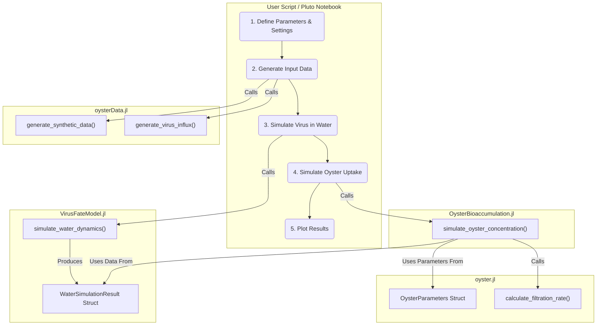
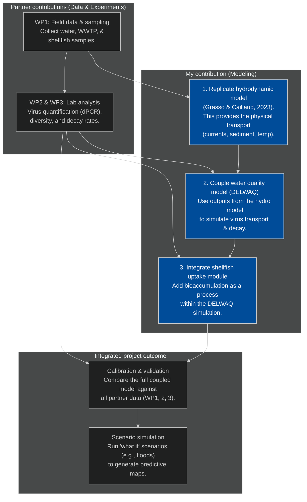

# PReVir project: Mechanistic modeling.

This repository serves as the central hub for the modeling work package of our project. The goal here is to develop a predictive, mechanistic model for enteric virus concentrations in coastal shellfish. We'll be using the Delft3D FM Suite (or the Grasso paper) to couple a hydrodynamic model with custom-built modules for virus fate and shellfish bioaccumulation, all driven by the experimental data our partners (you!) are generating.

On this page, I will be presenting and documenting all the code, project plans, and workflows related to this modeling effort. Please note that no experimental or field data will be shared here.

Your input is highly welcome. For any questions, suggestions, or contributions, please feel free to open an issue on this page or send me an email.

### build the hydrodynamic model
- [x] create/acquire the digital map for the estuaries.
- [ ] set up the physical forces driving water movement (tides, river flow, etc.).
- [ ] run initial simulations to ensure the model is stable before adding biology.
- [ ] if the existing model by grasso & caillaud is suitable, we may use their model outputs instead of running it ourselves.

### virus decay/adsorbtion module
- [x] Conceptualize how to integrate virus decay into water quality module. 
- [x] integrate the virus decay/behavior
- [ ] Adapt wp3 lab data (decay in relation to t, salinity, tss, virus genotype).
- [ ] add parameters for how viruses attach to sediment particles.
- [ ] connect this virus tracking module to the hydrodynamic model.

### shellfish uptake module
- [x] Conceptualize virus accumulation in oysters. 
- [x] Code the biological rules for how oysters filter and accumulate viruses.
- [x] integrate the module so it acts as a virus sink in the water model. The uptake compared to ambient is negliable. 
- [ ] prepare it for validation against the real oyster data from wp2.

### calibrate and validate
- [ ] align the model with measurements for both water and shellfish.
- [ ] analyze which factors (like specific decay rates or filtration efficiency) have the most significant impact on the results.

### run scenarios
- [ ] set up and simulate various "what if" scenarios.
- [ ] generate the final project outputs. predictive contamination maps and risk assessment charts.

---

# Current implementation



The simulation operates in two main stages. First, the **simulate_water_dynamics** function models the virus in the environment. Using environmental data and a virus influx schedule as inputs, it simulates the hourly concentrations of both dissolved and sorbed viruses in the water column. Second, the **simulate_oyster_concentration** function models the virus in an average oyster. It takes the water concentration results from the first step and, for each hour, calculates the net change in the oyster's internal virus level by balancing the rate of virus uptake (driven by filtration and assimilation efficiencies) against the rate of virus elimination (depuration). With the model structure now complete, we are ready for parameterization using inputs from the work packages. The next goal is to apply this calibrated model to a gridded, spatial dataset produced by the hydrodynamics. 

---

# The maths driving the simulation

## 1. virus fate and transport (`VirusFateModel.jl`)

This module models how virus concentrations change in the water column due to decay, sorption, and settling.

### Virus decay in water

The total decay rate for free-floating viruses in the water, $k_{total}$, is the sum of a background rate and a rate due to UV light. The background rate is dependent on temperature.

* **Temperature-dependent decay (**$k_{temp}$**):** A modified Arrhenius equation calculates the decay rate based on temperature.
  

```math
k_{temp}(T) = k_{20} \cdot \theta^{(T-20)}
```

where $k_{20}$ is the reference decay rate at 20°C, $\theta$ is the temperature coefficient, and $T$ is the water temperature in °C.

* **UV Light-Dependent Decay (**$k_{UV}$**):** The decay from UV light is a product of a light coefficient and the depth-averaged UVB intensity.
  

```math
k_{UV} = k_I \cdot \bar{I}_{UVB}
```

```math
\bar{I}_{UVB} = I_{UVB,0} \cdot \frac{1 - e^{-K_{ext} \cdot H}}{K_{ext} \cdot H}
```

where $k_I$ is the light-dependent decay coefficient

$\bar{I}_{UVB}$ is the average UVB intensity over the water column

$I_{UVB,0}$ is the surface intensity

$K_{ext}$ is the light extinction coefficient

$H$ is the water depth.


* **Decay of sorbed virus:** Viruses attached to particles are protected. Their decay rate is reduced by a `sorbed_protection_factor`.
  
```math
k_{sorbed} = k_{total} \cdot (1 - P_{sorbed})
```

where $P_{sorbed}$ is the sorbed protection factor.

### Differential equations for water column

The simulation solves a system of ordinary differential equations (`virus_dynamics_water!`) to find the concentration of dissolved virus ($C_{dissolved}$), sorbed virus ($C_{sorbed}$), and the cumulative settled amount ($C_{settled}$) over time.

```math
\frac{dC_{dissolved}}{dt} = -k_{total} \cdot C_{dissolved} - k_{ads} \cdot C_{dissolved} \cdot C_{TSS} + k_{des} \cdot C_{sorbed}
```

```math
\frac{dC_{sorbed}}{dt} = -k_{sorbed} \cdot C_{sorbed} + k_{ads} \cdot C_{dissolved} \cdot C_{TSS} - k_{des} \cdot C_{sorbed} - \frac{v_{settle}}{H} \cdot C_{sorbed}
```

```math
\frac{dC_{settled}}{dt} = v_{settle} \cdot C_{sorbed}
```

where $k_{ads}$ and $k_{des}$ are the adsorption and desorption rates, $C_{TSS}$ is the concentration of suspended solids, and $v_{settle}$ is the settling velocity.

---

## 2. Oyster biology (`oyster.jl`)

This module defines the oyster's filtration rate based on its size and environmental conditions. Largely based on:

https://doi.org/10.1016/j.ecolmodel.2014.11.023.

### Allometric Scaling

An oyster's base filtration rate is scaled by its dry weight ($W_{dw}$).

```math
\text{Scaling Factor} = W_{dw}^{0.75}
```

### Environmental limitation factors

The base rate is modified by dimensionless factors for temperature ( $f(T)$ ), salinity ( $f(S)$ ), and total suspended solids ( $f(TSS)$ ).

* **Temperature:**
  
```math
f(T) = e^{-0.006 \cdot (T - 27.0)^2}
```

* **Salinity:** A piecewise function based on salinity ($S$) in psu.

```math
f(S) = \begin{cases}
  0.0 & \text{if } S < 5.0 \\
  0.0926 \cdot (S - 0.0139) & \text{if } 5.0 \leq S \leq 12.0 \\
  1.0 & \text{if } S > 12.0
  \end{cases}
```

* **TSS:** A piecewise function based on TSS in mg/L.

```math
f(TSS) = \begin{cases}
  0.1 & \text{if } TSS < 4.0 \\
  1.0 & \text{if } 4.0 \leq TSS \leq 25.0 \\
  10.364 \cdot \ln(TSS) - 2.0477 & \text{if } TSS > 25.0
  \end{cases}
```

### Total filtration rate (FR)

The final rate combines all factors.

```math
FR \text{ (L/hr)} = 0.17 \cdot \text{Scaling Factor} \cdot f(T) \cdot f(S) \cdot f(TSS)
```

---

## 3. Oyster bioaccumulation (`OysterBioaccumulation.jl`)

This module calculates the concentration of virus inside the oyster.

### Pseudofeces rejection (**$f_{pseudo}$**)

The fraction of filtered particles rejected by the oyster is modeled as a linear ramp between a lower ($TSS_{reject}$) and upper ($TSS_{clog}$) threshold for suspended solids.

```math
f_{pseudo} = \frac{TSS - TSS_{reject}}{TSS_{clog} - TSS_{reject}} \quad (\text{for } TSS_{reject} < TSS < TSS_{clog})
```

### Depuration rate (**$k_{dep}$**)

The rate at which the oyster eliminates viruses is temperature-dependent.

```math
k_{dep}(T) = k_{dep,20} \cdot \theta_{dep}^{(T-20)}
```

where $k_{dep,20}$ is the depuration rate at 20°C and $\theta_{dep}$ is its temperature coefficient.

---

### How the final oyster concentration is calculated

The concentration of virus in the oyster ($C_{oyster}$) is calculated in the `simulate_oyster_concentration` function by looping through each hour and solving for the net change based on the processes of Uptake and Elimination. The governing differential equation is:

```math
\frac{dC_{oyster}}{dt} = \frac{\text{Total Uptake Rate}}{W_{dw}} - k_{dep} \cdot C_{oyster}
```

The two main terms are calculated as follows at each time step:

* **Total uptake rate (vg/day):** This is the total number of viruses assimilated by the oyster per day. It's the sum of assimilated free and sorbed viruses.

  1. **Filtration:** The total amount of free and sorbed virus captured is calculated:

     * `filtered_free` = $FR \cdot C_{dissolved}$

     * `filtered_sorbed` = $FR \cdot C_{sorbed}$

  2. **Rejection:** The particulate (sorbed) fraction is reduced by the pseudofeces rejection factor:

     * `ingested_sorbed` = `filtered_sorbed` $\cdot (1 - f_{pseudo})$

  3. **Assimilation:** Final assimilation efficiencies ($\epsilon_{free}$, $\epsilon_{sorbed}$) are applied to the ingested amounts.

     * `assimilated_free` = `filtered_free` $\cdot \epsilon_{free}$

     * `assimilated_sorbed` = `ingested_sorbed` $\cdot \epsilon_{sorbed}$
       The **Total uptake rate** is the sum of `assimilated_free` and `assimilated_sorbed`.

* **Total elimination rate (vg/g/day):** This is the rate at which the oyster clears the virus it has already accumulated. It's the product of the temperature-dependent `depuration_rate` ($k_{dep}$) and the current internal virus concentration (`c_oyster`).

The simulation uses these two rates to step forward in time, continuously updating the oyster's internal concentration based on the changing environmental conditions and water contamination levels.

A reminder; $W_{dw}$ is the dry oyster weight. We are dealing with virus per gram here. 
    
---

# An example simulation

When I combine all aspects, we can model virus accumulation in oysters in a synthetic dataset. The synthetic dataset is generated using:

```julia
sim_days = 12
env_df = generate_synthetic_data(sim_days)

289×5 DataFrame
 Row │ Hour     Temperature_C  Salinity_ppt  TSS_kg_m3   Surface_UVB_W_m2 
     │ Float64  Float64        Float64       Float64     Float64
─────┼────────────────────────────────────────────────────────────────────
   1 │     0.0        14.25         25.0     0.008                0.0
   2 │     1.0        13.9393       24.1204  0.00964863           0.0
  ⋮  │    ⋮           ⋮             ⋮            ⋮              ⋮
 288 │   287.0        14.6118       22.2847  0.0123773            0.0
 289 │   288.0        14.25         19.06    0.0148395            0.0
                                                          280 rows omitted
```

Which generates synthetic data with 
- a daily temperature cycle (a cosine wave)
- tidal salinity cycle (cosine wave with a ~12.4 hr period)
- tidal TSS cycle (modeled with a squared sine wave to produce two peaks per cycle).
- daily solar radiation cycle modeled as a clipped sine wave, active only during daylight hours.

Then I need influx data. For this example this function also generates a spike caused by WTTP overflow/bypas. ```julia influx_df = generate_virus_influx(sim_days) ```

Then I define virus and shellfish properties:

```julia
virus_params = VirusParameters(
    0.23,       # k20: Reference decay rate at 20°C
    1.076,      # theta: Temperature adjustment coefficient for decay
    0.0,        # alpha: Salinity effect coefficient
    0.05,       # k_I: UV light decay coefficient
    1.0,        # adsorption_rate: Rate of attachment to particles
    0.2,        # desorption_rate: Rate of detachment from particles
    0.05,       # settling_velocity: Sinking speed of sorbed virus [m/day] 
    0.5         # sorbed_protection_factor: (50%) reduction in decay when sorbed 
)

oyster_params = OysterParameters(
    1.0,        # dry_weight_g: Dry weight of the oyster in grams 
    0.107,      # k_dep_20: Depuration (elimination) rate at 20°C 
    1.055,      # theta_dep: Temperature coefficient for depuration 
    100.0,      # tss_rejection_threshold: TSS level to start rejecting particles [mg/L]
    200.0,      # tss_clogging_threshold: TSS level for maximum particle rejection [mg/L]
    0.5,        # efficiency_free: (50%) uptake efficiency for free viruses
    1           # efficiency_sorbed: (100%) uptake efficiency for sorbed viruses 
)
```

Then I can run the composite model with using the synthetic data and the structs.

```julia
water_sim = simulate_water_dynamics(virus_params, env_df, influx_df, [100, 0.0, 0.0]);
oyster_sim = simulate_oyster_concentration(oyster_params, env_df, water_sim)
```

We can then visualize the results. 

```julia
begin
    p_water = lineplot(
        water_sim.time,
        water_sim.dissolved_conc,
        name="Virus (dissolved)",
        title="Virus in Water Column",
        xlabel="Time (hours)",
        ylabel="Conc (vg/m³)",
        yscale=:log10,
        width=70,
        height=15,
        ylim = (10^0, 10^6),
        canvas = BrailleCanvas
    )

    lineplot!(p_water, water_sim.time, water_sim.sorbed_conc; name = "Virus (sorbed)")
    #lineplot!(p_water, water_sim.time, water_sim.dissolved_conc; name = "Virus (free)")
    lineplot!(p_water, water_sim.time, water_sim.settled_conc; name = "Virus (settled)")

    lineplot!(
        p_water,
        water_sim.time,
        oyster_sim;
        name ="Virus in oyster"
    )
end
```


# Basic plans WUR as a flowchart

The initial plan as a mermaid flowchart. Not the final version. 


