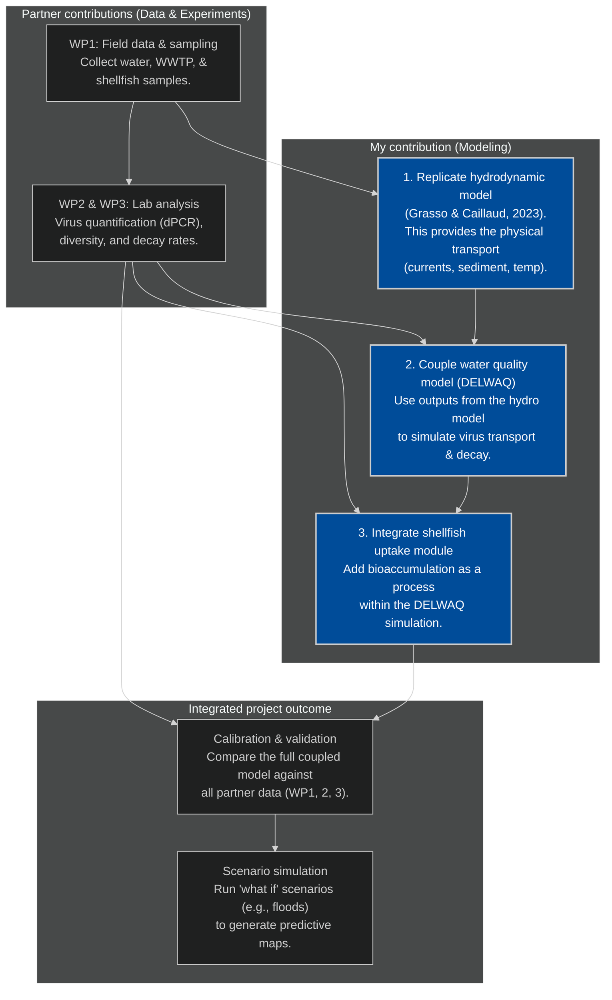

# Previr WUR modelling plans and ideas

## Modeling virus decay and fate

This section presents the initial idea for simulating the decay and fate of virusses in aquatic environmenments (Loire etc) using the WP data. I think representing each genotype (`Norovirus_GI`, `Norovirus_GII.4`, etc) as a separate "substance" with its own decay and adsorption properties will give the best results. 

### Total decay rate for each genotype
Decay rate is a combination of base temperature-driven decay and a modifying salinity factor:

$k_{\text{total}} = k_{\text{dark}}(T) \cdot f(S)$

- $k_{\text{dark}}(T)$: Temperature-dependent decay rate.
- f(S): Factor accounting for salinity.

### Temperature and genotype-specific decay

Temperature ~ decay often follows an Arrhenius equation:

$k_{\text{dark}}(T) = k_{20,\text{genotype}} \cdot \theta_{\text{genotype}}^{(T - 20)}$

- $k_{20,\text{genotype}}$: Reference decay rate at 20°C (from WP3 lab experiments). (or at another temperature. I don't remeber exactly which temperatures were chosen). 

- $\theta_{\text{genotype}}$: Temperature adjustment coefficient (derived from fitting on measured data).

- Water temperature (°C), from the hydrodynamic model.

### Salinity-dependent decay 

Salinity ~ virus persistence/decay could be represented by a linear function:

$f(S) = \alpha \cdot S + \beta$

- $S$: Local salinity (from hydrodynamic model).
- $\alpha$, $\beta$: Coefficients derived from WP3 experiments.

It could also be non-linear. We will see. 

### Adsorption & desorption 

The interaction of viruses with total suspended solids (TSS) is modeled as a reversible kinetic process:

$\frac{dC_{\text{ads,genotype}}}{dt} = \left( k_{\text{ads,genotype}} \cdot C_{\text{free,genotype}} \cdot TSS \right) - \left( k_{\text{des,genotype}} \cdot C_{\text{ads,genotype}} \right)$

- $C_{\text{free,genotype}}$: Free-floating virus concentration.
- $C_{\text{ads,genotype}}$: Particle-bound virus concentration.
- $TSS$: Total suspended solids (from hydrodynamic model).
- $k_{\text{ads,genotype}}$, $k_{\text{des,genotype}}$: Genotype-specific adsorption/desorption rates.

## Basic plans wur as a flowchart

The initial plan as a mermaid flowchart. Not the final version. 

