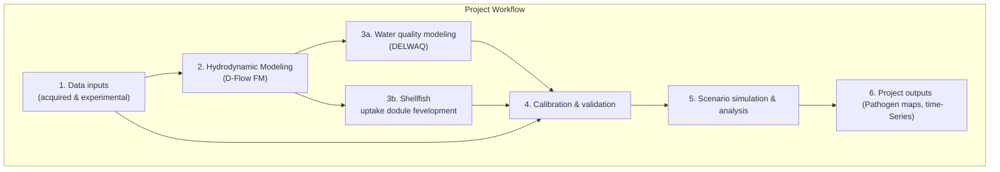

```mermaid
graph TD
    subgraph "Project Workflow"
        A["1. Data inputs <br> (acquired & experimental)"] --> B["2. Hydrodynamic Modeling <br> (D-Flow FM)"];
        B --> C["3a. Water quality modeling <br> (DELWAQ)"];
        B --> D["3b. Shellfish <br> uptake dodule fevelopment"];
        C --> E["4. Calibration & validation"];
        D --> E;
        A --> E;
        E --> F["5. Scenario simulation & analysis"];
        F --> G["6. Project outputs <br> (Pathogen maps, time-Series)"];
    end

```
