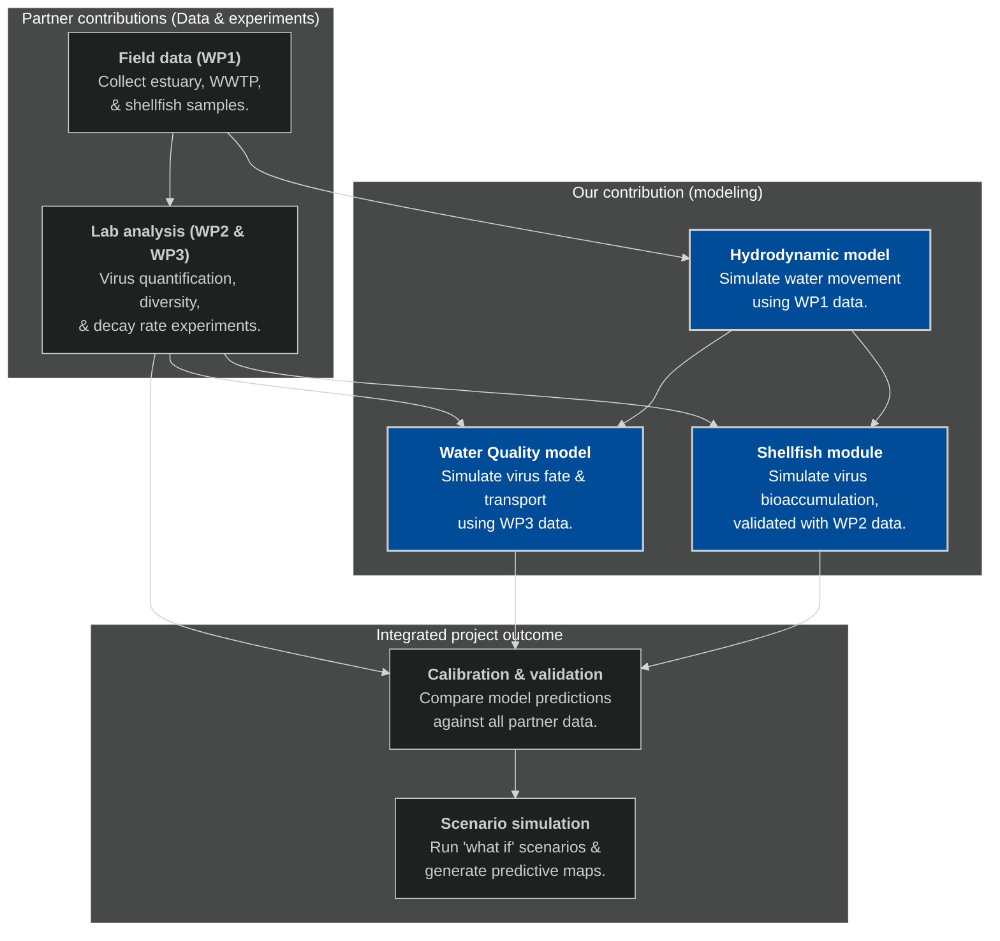

```mermaid

%%{init: {'theme': 'dark', 'themeVariables': {'background': '#002060'}}}%%
graph TD
    subgraph "Partner contributions (Data & experiments)"
        A["<b>Field data (WP1)</b><br>Collect estuary, WWTP,<br>& shellfish samples."]
        B["<b>Lab analysis (WP2 & WP3)</b><br>Virus quantification, diversity,<br>& decay rate experiments."]
    end

    subgraph "Our contribution (modeling)"
        C["<b>Hydrodynamic model</b><br>Simulate water movement<br>using WP1 data."]
        D["<b>Water Quality model</b><br>Simulate virus fate & transport<br>using WP3 data."]
        E["<b>Shellfish module</b><br>Simulate virus bioaccumulation,<br>validated with WP2 data."]
    end

    subgraph "Integrated project outcome"
        F["<b>Calibration & validation</b><br>Compare model predictions<br>against all partner data."]
        G["<b>Scenario simulation</b><br>Run 'what if' scenarios &<br>generate predictive maps."]
    end

    A --> C
    A --> B
    B --> D
    B --> E
    B --> F
    C --> D
    C --> E
    D --> F
    E --> F
    F --> G

    style C fill:#004c99,stroke:#ccc,stroke-width:2px,color:#fff
    style D fill:#004c99,stroke:#ccc,stroke-width:2px,color:#fff
    style E fill:#004c99,stroke:#ccc,stroke-width:2px,color:#fff


```
