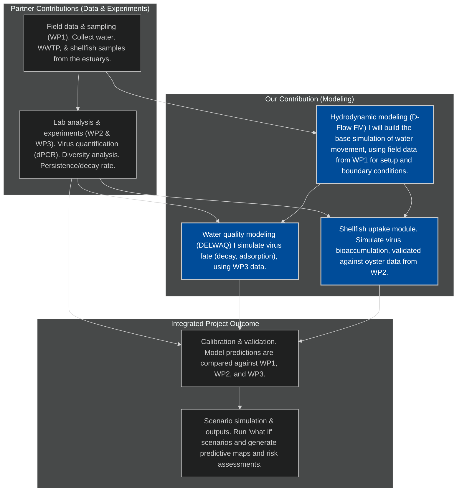

```mermaid

%%{init: {'theme': 'dark', 'themeVariables': {'background': '#002060'}}}%%
graph TD
    subgraph "Partner Contributions (Data & Experiments)"
        A[" Field data & sampling (WP1). Collect water, WWTP, & shellfish samples from the estuarys."]
        B[" Lab analysis & experiments (WP2 & WP3). Virus quantification (dPCR). Diversity analysis. Persistence/decay rate."]
    end

    subgraph "Our Contribution (Modeling)"
        C[" Hydrodynamic modeling (D-Flow FM) I will build the base simulation of water movement, using field data from WP1 for setup and boundary conditions."]
        D[" Water quality modeling (DELWAQ) I simulate virus fate (decay, adsorption), using WP3 data."]
        E[" Shellfish uptake module. Simulate virus bioaccumulation, validated against oyster data from WP2."]
    end

    subgraph "Integrated Project Outcome"
        F[" Calibration & validation. Model predictions are compared against WP1, WP2, and WP3."]
        G[" Scenario simulation & outputs. Run 'what if' scenarios and generate predictive maps and risk assessments."]
    end

    A --> C
    A --> B
    B --> D
    B --> E
    B --> F
    C --> D
    C --> E
    D --> F
    E --> F
    F --> G

    style C fill:#004c99,stroke:#ccc,stroke-width:2px,color:#fff
    style D fill:#004c99,stroke:#ccc,stroke-width:2px,color:#fff
    style E fill:#004c99,stroke:#ccc,stroke-width:2px,color:#fff


```
